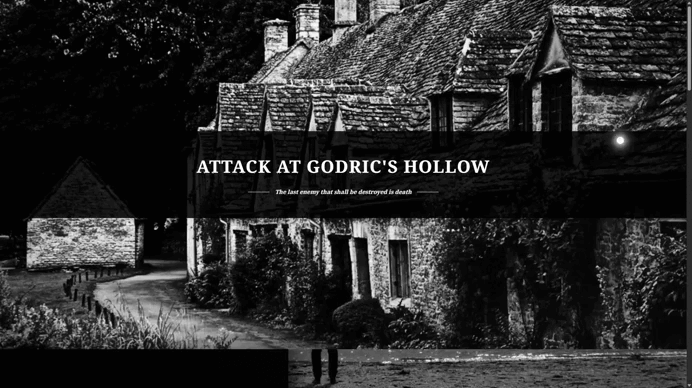

# PAGINA-BLACK
## Harry Potter illustration mock-up

## Starting 🚉
_The main idea of the project is to build on the **Harry Potter** saga where it explains its characters and some events that happened in **Attack at Godric's Hollow (1997)**._

## Historical context 📓
 - **_Attack at Godric's Hollow (1997)_**
 
_The attack on Godric's Hollow on Christmas Eve 1997 was an ambush by Nagini, Lord Voldemort's snake, in Harry Potter that occurred during the height of the Second Magic War._

_The snake was planted in Bathilda Bagshot's animated corpse to wait to see if Harry would come to see his parents' graves in Godric's Hollow, and then to hold him there until Voldemort arrived to assassinate him. Harry eventually came with his friend Hermione Granger, and the two narrowly escaped death at Voldemort's hands._

